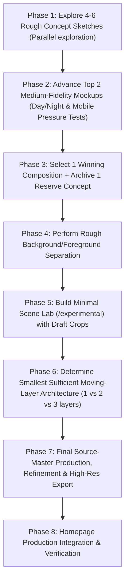
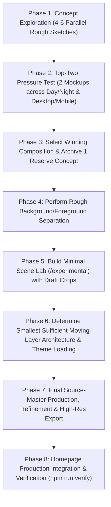

# Homepage Hero Replacement Investigation

## 1. Executive conclusion

### Viability & Scope
Replacing the current homepage "sad person" / `ManSorrow` SVG illustration with a calm "systems observatory" overlooking a Washington, D.C. landscape is visually viable and will improve semantic structure and rendering architecture.

This document is strictly an **investigation and planning report**. No code modifications, asset generation, component creation, or dependency installations have been performed in this step.

### Key Technical Findings & Architectural Direction
1. **Above-the-Fold `@defer` Cleanup** *(confirmed repository fact)*: The hero section is currently wrapped in `@defer(on immediate)` with a spinning loader placeholder. Because of this, no semantic text (`<h1>`, bio, links) or illustration markup exists in the prerendered static HTML. Removing `@defer` for above-the-fold content ensures immediate static rendering during SSR.
2. **Elimination of String-Generated SVG** *(confirmed repository fact)*: The current `ManSorrow` illustration is constructed at runtime using Angular `DomSanitizer.bypassSecurityTrustHtml` over JavaScript data arrays, locked behind `platformCheck.onBrowser`. This creates a 56.93 kB client JS chunk that does not render on the server.
3. **Layer Architecture** *(project hypothesis)*: A hybrid structure separating background/desk artwork, code-controlled SVG overlays (map routes and display charts that inherit `--primary-color`), and semantic HTML for text/controls provides the best balance of maintainability, edge quality, and performance.
4. **Progressive Enhancement for Motion** *(standard/platform guidance)*: CSS Scroll-Driven Animations (`animation-timeline`) avoid JavaScript scroll listeners. Because browser support remains limited across engines, scroll motion must be implemented strictly as a progressive enhancement with static fallbacks.

---

## 2. Confirmed current-repository facts

The following facts were directly verified by inspecting the repository source code and build manifests:

- **Root Shell**: [AppTheme](file:///c:/Users/dnowi/Documents/Github/personal/src/app/app.theme.component.ts) (`src/app/app.theme.component.ts`) containing `<main class="site-main max-w-screen-lg mx-auto px-4 md:px-10 mt-20 mb-4 overflow-x-hidden"> <router-outlet /> </main>`. *(confirmed repository fact)*
- **Home Page Component**: [HomeComponent](file:///c:/Users/dnowi/Documents/Github/personal/src/app/pages/home/home.component.ts) (`src/app/pages/home/home.component.ts`) rendering `<intro />` and `<expertise-area />`. *(confirmed repository fact)*
- **Hero Container Component**: [Intro](file:///c:/Users/dnowi/Documents/Github/personal/src/app/pages/home/expertise-area/intro.ts) (`src/app/pages/home/expertise-area/intro.ts`) containing:
  - Defer block: `@defer(on immediate) { <section class="mt-8 relative"> ... </section> } @placeholder { <loader /> }`
  - Illustration call: `<man-sorrow class="flex justify-end"/>`
  - Profile card: `div.w-full.sm:w-auto.flex.flex-col.gap-3.justify-between.sm:absolute.top-0.left-0.sm:top-5.bg-gray-400...` *(confirmed repository fact)*
- **Illustration Component**: [ManSorrow](file:///c:/Users/dnowi/Documents/Github/personal/src/app/pages/home/expertise-area/man-sorrow/man-sorrow.ts) (`src/app/pages/home/expertise-area/man-sorrow/man-sorrow.ts`) with template `@if(platformCheck.onBrowser) { <svg class="animated w-11/12" id="man-sorrow" viewBox="0 0 750 500"> ... </svg> }`. *(confirmed repository fact)*
- **SVG Generation Method**: String-generated SVG via `DomSanitizer.bypassSecurityTrustHtml` mapping JavaScript shape data files in `src/app/pages/home/expertise-area/man-sorrow/shape/` (`cloud.ts`, `floor.ts`, `man.ts`, `moon.ts`, `plant.ts`, `sea.ts`, `stars.ts`, `sun.ts`). *(confirmed repository fact)*
- **Static Prerender Behavior**: **ABSENT during static prerendering**. `platformCheck.onBrowser` evaluates to `false` during SSR/static prerendering, and `@defer` emits only `<loader>` in the prerendered HTML output `dist/dnowinski/browser/index.html`. *(confirmed repository fact)*
- **Illustration Dimensions & ViewBox**: `viewBox="0 0 750 500"` (3:2 aspect ratio), formatted with `class="animated w-11/12"`. *(confirmed repository fact)*
- **Responsive Layout & Stacking Breakpoint**:
  - Tailwind v3 breakpoint: **`sm` (640px)**.
  - `< sm` (under 640px): Profile card has `w-full` and stays in normal document flow, **stacked below** `<man-sorrow>`.
  - `>= sm` (640px and wider): Profile card receives `sm:w-auto` and `sm:absolute top-0 left-0 sm:top-5`, **floating overlaid** over the top-left of the hero section. *(confirmed repository fact)*
- **Lower Section Coupling**: `<expertise-area />` is a sibling component directly below `<intro />` inside `HomeComponent`. There is **zero structural coupling** between `<intro>` and `<expertise-area>`. *(confirmed repository fact)*
- **Theme & Accent Services**:
  - [DarkModeService](file:///c:/Users/dnowi/Documents/Github/personal/src/app/core/services/dark-mode.service.ts) toggles `dark` class on `document.documentElement`.
  - [ThemeService](file:///c:/Users/dnowi/Documents/Github/personal/src/app/core/services/theme.service.ts) sets CSS custom property `--primary-color` on `<app-root>` via an Angular `effect()`. *(confirmed repository fact)*
- **Supported Accent Colors**: 7 hex values defined in [theme-color.data.ts](file:///c:/Users/dnowi/Documents/Github/personal/src/app/data/theme-color.data.ts): `#0252a7`, `#E94823`, `#eab308`, `#a70210`, `#02a736`, `#4b369d`, `#79911d`. Exposed in [tailwind.config.ts](file:///c:/Users/dnowi/Documents/Github/personal/tailwind.config.ts) via `color-mix(in srgb, var(--primary-color), white/black X%)`. *(confirmed repository fact)*
- **Build Output Bundle Costs**:
  - `man-sorrow` lazy chunk (`chunk-ZF32SSEX.js`): **56.93 kB raw** (16.99 kB estimated transfer).
  - Initial JS bundle: 741.34 kB raw (183.82 kB transfer).
  - CSS bundle (`styles-RUTV53G6.css`): 121.82 kB raw (14.20 kB transfer). *(confirmed repository fact)*

---

## 3. Current performance and rendering baseline

### Status of Performance Measurements
- **Lighthouse / Performance Tracing**: No Lighthouse lab runs, Chrome DevTools Performance traces, or CrUX field queries were performed during this initial codebase audit. *(untested suggestion)*
- **LCP / CLS / INP Measurement Status**: Empirical baseline values for LCP, CLS, and INP on the homepage are currently **unmeasured**. *(untested suggestion)*
- **Observed Static HTML Issue**: Inspection of `dist/dnowinski/browser/index.html` confirms that because `@defer(on immediate)` wraps `<intro>`, the prerendered static HTML contains only a spinner (`<loader>`). The LCP element is initially the header or loader, and text/illustration pop-in occurs only after client JS hydration completes. *(confirmed repository fact)*

### Method for Establishing Empirical Baselines & Targets
Rather than creating arbitrary byte budgets prior to measurement, project targets should be established using the following procedure:

1. **Establish Laboratory Baseline**:
   - Run 5–10 repeated Lighthouse / Chrome DevTools performance trace runs on the current production build using throttled CPU (4x slowdown) and Mobile emulation (390px viewport, Fast 4G).
   - Record the median LCP element candidate, LCP time (ms), CLS score, and main-thread layout task duration.
2. **Align with Official Core Web Vitals Thresholds**:
   - **Largest Contentful Paint (LCP)**: Good $\le 2.5\text{s}$, Needs Improvement $\le 4.0\text{s}$, Poor $> 4.0\text{s}$. (Source: [web.dev LCP Guide](https://web.dev/articles/lcp), accessed 2026-07-21). *(standard/platform guidance)*
   - **Cumulative Layout Shift (CLS)**: Good $\le 0.10$, Needs Improvement $\le 0.25$, Poor $> 0.25$. (Source: [web.dev CLS Guide](https://web.dev/articles/cls), accessed 2026-07-21). *(standard/platform guidance)*
   - **Interaction to Next Paint (INP)**: Good $\le 200\text{ms}$, Needs Improvement $\le 500\text{ms}$, Poor $> 500\text{ms}$. (Source: [web.dev INP Guide](https://web.dev/articles/inp), accessed 2026-07-21). *(standard/platform guidance)*
3. **Derive Future Asset Byte Budgets**:
   - Measure network transfer speed under simulated 4G (~1.6 Mbps download).
   - Calculate total available byte envelope for above-the-fold assets to achieve LCP $\le 2.5\text{s}$ (accounting for HTML parsing, CSS render-blocking stylesheets, and font loading).
   - Test AVIF vs WebP compression settings on actual exported scene artwork to find the smallest file size that maintains acceptable visual quality.

---

## 4. External evidence and current best practices

### Standards & Platform Guidance (with Direct Sources)

| Area | Direct Source URL & Access Date | Key Requirement / Guideline Summary | Label |
| :--- | :--- | :--- | :--- |
| **Angular Image Optimization** | [Angular Image Optimization Guide](https://angular.dev/guide/image-optimization) (accessed 2026-07-21) | Use `ngSrc` with `priority` for LCP images. Injects preload hints during SSR. **Note: `NgOptimizedImage` does not support HTML `<picture>`.** | *(standard/platform guidance)* |
| **Angular Defer Control** | [Angular @defer Guide](https://angular.dev/guide/defer) (accessed 2026-07-21) | Do NOT wrap above-the-fold LCP content in `@defer`. It delays bundle execution and hides semantic HTML from static prerender output. | *(standard/platform guidance)* |
| **WCAG 2.2 SC 1.4.3 (Text Contrast)** | [W3C WCAG 2.2 SC 1.4.3](https://www.w3.org/TR/WCAG22/#contrast-minimum) (accessed 2026-07-21) | Text and essential UI text controls must meet $\ge 4.5:1$ contrast against their background ($\ge 3:1$ for large text). | *(standard/platform guidance)* |
| **WCAG 2.2 SC 1.4.11 (Non-Text Contrast)** | [W3C WCAG 2.2 SC 1.4.11](https://www.w3.org/TR/WCAG22/#non-text-contrast) (accessed 2026-07-21) | User interface components and graphical objects essential for understanding require $\ge 3:1$ contrast against adjacent colors. | *(standard/platform guidance)* |
| **WCAG 2.2 SC 2.2.2 (Pause, Stop, Hide)** | [W3C WCAG 2.2 SC 2.2.2](https://www.w3.org/TR/WCAG22/#pause-stop-hide) (accessed 2026-07-21) | Automatically starting, continuous blinking/twinkling content lasting $>5\text{s}$ must have a pause mechanism OR cease within $5\text{s}$. | *(standard/platform guidance)* |
| **WCAG 2.2 SC 2.3.3 (Motion Interaction)** | [W3C WCAG 2.2 SC 2.3.3](https://www.w3.org/TR/WCAG22/#animation-from-interactions) (accessed 2026-07-21) | Motion triggered by user interaction (e.g. scroll depth) must respect `prefers-reduced-motion: reduce`. | *(standard/platform guidance)* |
| **CSS Scroll-Driven Animations** | [MDN animation-timeline](https://developer.mozilla.org/en-US/docs/Web/CSS/animation-timeline) & [W3C Scroll Spec](https://drafts.csswg.org/scroll-animations-1/) (accessed 2026-07-21) | Native scroll timeline features are limited availability / not Baseline. Treat strictly as progressive enhancement. | *(standard/platform guidance)* |
| **Parallel Prototyping Research** | [Dow et al. (Stanford HCI, 2010)](https://hci.stanford.edu/publications/2010/parallel-prototyping/) (accessed 2026-07-21) | Parallel prototyping yields greater visual diversity, lower design fixation, and higher rated outcomes than serial iteration. | *(research-supported principle)* |

---

## 5. Questions that do not have universal answers

The following technical and visual trade-offs require empirical testing within this specific codebase:

1. **Parallax Motion Amplitude**: What vertical pixel offset during scroll creates depth without causing visual disorientation or layout overlap? *(untested suggestion)*
   - *Test Plan*: Evaluate static baseline vs low-amplitude displacement in the Scene Lab.
2. **Star Animation Policy**: Which star twinkling policy (auto-stop within 5s, continuous with UI toggle, or static) provides the best balance of atmosphere and WCAG 2.2 compliance? *(untested suggestion)*
   - *Test Plan*: Benchmark accessibility trade-offs in the Scene Lab.
3. **Image Format & Quality Threshold**: Does AVIF or WebP yield a better quality-to-byte ratio for the D.C. skyline at 80% quality compression? *(untested suggestion)*
   - *Test Plan*: Compare compressed byte sizes and gradient band artifacts across candidate exports.

---

## 6. Concept-exploration recommendation

### Research Basis: Parallel Prototyping
- **Dow et al. (Stanford HCI Group, 2010)**: Demonstrates that creating multiple design alternatives in parallel (rather than serially iterating on a single initial concept) leads to greater visual diversity, reduced design fixation, and higher rated final outcomes. *(research-supported principle)*
- **Concept Count Categorization**:
  - *Parallel alternatives principle*: Supported by research (Dow et al., 2010). *(research-supported principle)*
  - *Specific count of 4–6 initial sketches*: Project-chosen hypothesis for manageable manual exploration. *(project hypothesis)*
  - *2 medium-fidelity candidates*: Project-chosen funnel gate. *(project hypothesis)*
  - *1 winner + 1 reserve*: Project-chosen risk mitigation strategy. *(project hypothesis)*

### Revised Production Sequence



---

## 7. Proposed visual-production architecture

To resolve potential contradictions between semantic visual groups and technical file/DOM layers, the architecture is defined across five distinct categories:

### 1. Semantic Scene Objects
- **Background**: Distant D.C. skyline (Washington Monument, Capitol silhouette), Potomac water, sky.
- **Midground / Foreground**: Observatory desk, notebook, coffee mug, display screen frame, beacon light structure.
- **Overlays**: Map route lines, display chart data lines, night sky stars.
- **Content Card**: Profile intro text, bio, resume button, social links. *(project hypothesis)*

### 2. Source-File Layers (Photoshop / Figma Master)
- `[Group] SVG-Accent-Paths` (Vector reference paths for map and screen charts)
- `[Group] Foreground-Desk-Objects` (Desk surface, notebook, mug, display)
- `[Group] Night-Lighting-Adjustments` (Color lookup layers, window glow, ambient dark mode lighting)
- `[Group] Background-Skyline` (Potomac water, D.C. monuments, sky gradient) *(project hypothesis)*

### 3. Exported Assets
- `hero-bg-desktop-day.avif` / `.webp`
- `hero-bg-desktop-night.avif` / `.webp`
- `hero-bg-mobile-day.avif` / `.webp`
- `hero-bg-mobile-night.avif` / `.webp`
- *(Optional separate foreground desk asset ONLY if parallax depth testing in the minimal Scene Lab proves a multi-image DOM structure is visually justified and performant).* *(project hypothesis)*

### 4. DOM Elements & Stacking Order
- **DOM Layer 1 (Bottom)**: Background artwork element (`<picture>` or theme-aware container).
- **DOM Layer 2**: Inline `<svg>` overlay containing map routes and display line charts styled via CSS `stroke="var(--primary-color)"`.
- **DOM Layer 3**: Star element container (Dark mode only).
- **DOM Layer 4 (Top)**: Semantic HTML `<div>` for the Profile Card (`<h1>`, bio, links). *(project hypothesis)*

### 5. Moving Depth Groups
- **Group A (Static)**: Background skyline & DOM structure (`transform: none`).
- **Group B (Optional Progressive Scroll)**: Foreground desk element (if separated) evaluated via CSS animation timelines in the Scene Lab. *(project hypothesis)*

---

## 8. AI-tool capability and bake-off plan

### Tool Capability & Limitations Matrix

| Tool / Platform | Current Documented Capabilities | Transparent & Vector Outputs | Untested Predictions & Limitations |
| :--- | :--- | :--- | :--- |
| **ChatGPT Pro (OpenAI Image Models)** | Text-to-image generation, conversational editing, and transparent background PNG export. | Supports transparent raster PNG export. Does NOT produce layered PSD or clean vector SVG files. | *Geometry preservation across day/night prompts is an untested hypothesis requiring empirical bake-off testing.* *(project hypothesis)* |
| **Google Gemini (Imagen Models)** | High-fidelity image generation and editing via Imagen 3 / Gemini interface. | Raster output only. Does NOT produce layered PSD or vector SVG exports. Model availability & features subject to API/interface updates. | *Lighting quality is high, but geometry preservation across relighting edits is an untested hypothesis.* *(project hypothesis)* |
| **Anthropic Claude (Pro 5x)** | Text, code, and SVG markup generation; architectural critique. | Generates clean inline vector SVG code. Does NOT generate raster PNG/WebP images. | *SVG coordinate precision is high for clean geometry, but complex atmospheric textures require raster pairing.* *(project hypothesis)* |
| **Higgsfield** | Image editing, inpainting, object removal, background reconstruction, background removal, relighting, and video motion synthesis. | Raster output with background removal capabilities. | *Suitability for clean static background-plate reconstruction and relighting is an untested hypothesis requiring bake-off validation.* *(project hypothesis)* |
| **Codex / Local Repository** | Codebase search, file editing, test execution, build validation. | Manipulates code, HTML/SVG markup, and configuration files. | Cannot generate or paint visual artwork directly. *(confirmed repository fact)* |
| **Photopea / Photoshop / Figma** | Layered visual editing, precise mask extraction, WebP/AVIF export. | Full support for layered PSD, vector paths, alpha transparency, and multi-format exports. | Requires manual image editing effort. *(standard/platform guidance)* |

### Controlled AI Relighting & Reconstruction Bake-Off Plan
To evaluate whether AI tools can reliably relight a composition or reconstruct hidden background plates:
1. **Task A (Relighting)**: Input 1 base Day composition draft into Gemini, ChatGPT, and Higgsfield. Request a Night mode relighting while maintaining identical object geometry. *(project hypothesis)*
2. **Task B (Background Reconstruction)**: Test Higgsfield and Photoshop Content-Aware Inpainting to reconstruct the background plate hidden behind extracted foreground desk objects. *(project hypothesis)*
3. **Evaluation Metric**: Import outputs into Photopea/Photoshop, apply `Difference` blend mode against the base image, and inspect alignment on key landmarks (Washington Monument, desk edge). *(project hypothesis)*
4. **Pass/Fail Threshold**: If AI generation introduces visual misalignment on fixed structural edges, the Day master image will be manually relighted in a photo editor using adjustment layers rather than AI re-generation. *(project hypothesis)*

---

## 9. Responsive-art-direction plan

### Viewport Screenshot-Test Matrix

| Viewport Category | Width | Stacking Behavior | Target Device / Test Purpose |
| :--- | :--- | :--- | :--- |
| **Narrow Mobile** | 360px | Stacked (Card below artwork) | Small Android phones *(project hypothesis)* |
| **Standard Mobile** | 390px | Stacked (Card below artwork) | iPhone 12/13/14/15 Pro *(project hypothesis)* |
| **Breakpoint Minus 1** | 639px | Stacked (Card below artwork) | Mobile layout boundary *(confirmed repository fact)* |
| **Exact Breakpoint** | 640px (`sm`) | Overlaid (Card floats top-left) | Stacking transition boundary *(confirmed repository fact)* |
| **Breakpoint Plus 1** | 641px | Overlaid (Card floats top-left) | Layout transition check *(confirmed repository fact)* |
| **Tablet Width** | 768px (`md`) | Overlaid (Card floats top-left) | Medium screen accommodation *(confirmed repository fact)* |
| **Desktop Container** | 1024px (`lg`) | Overlaid (Card floats top-left) | Site shell max-width boundary *(confirmed repository fact)* |
| **Wide Desktop** | 1440px | Overlaid (Centered in shell) | High-res desktop display *(project hypothesis)* |

---

## 9B. Theme-aware asset loading architecture

### The Architectural Tension
A fundamental technical conflict exists between HTML image loading standard mechanisms and the site's dark mode implementation:
- **Repository Fact**: The site manages dark mode via a saved user preference in `localStorage` (`DarkModeService`), toggling a `.dark` CSS class on `document.documentElement` (`<html>`), with system fallback `prefers-color-scheme: dark`. *(confirmed repository fact)*
- **Platform Constraint**: The standard HTML `<picture>` element with `<source media="(prefers-color-scheme: dark)">` checks **ONLY the OS system preference**, completely ignoring the user's manual `.dark` class toggle or saved `localStorage` choice. *(standard/platform guidance)*

### Analysis of Viable Candidate Approaches

| Candidate Approach | How It Operates | Hydration & FOUC Behavior | Double-Download & Network Cost | Priority LCP Preload Ability | Assessment |
| :--- | :--- | :--- | :--- | :--- | :--- |
| **Approach A: CSS Class-Based Dual `<picture>` Display Toggle** | Renders two `<picture>` elements (or background containers), one for `.light-hero` and one for `.dark-hero`. CSS rules (`html.dark .light-hero { display: none }`) control visibility. | **Zero FOUC / Zero Hydration Flash**. Renders instantly during SSR static prerender. | Risk of double image download if non-matching picture source is loaded before CSS evaluation. Can be mitigated using CSS background-image or `loading="lazy"` on inactive element. | High for default theme; secondary for alternate. | **Requires Scene Lab Testing** *(project hypothesis)* |
| **Approach B: Inline Head Script Theme Initialization** | Executes a tiny blocking inline `<script>` in document `<head>` during SSR render that reads `localStorage` and sets `html.dark` before initial paint. | **Zero FOUC**. Prevents flash of unstyled theme on initial HTML render. | Paired with CSS display rules, prevents downloading the inactive theme image post-render. | High for stored user preference. | **Requires Scene Lab Testing** *(project hypothesis)* |
| **Approach C: Dynamic Angular Signal Signal/State (`@if`)** | Uses Angular `darkModeService.isDark()` signal in template to conditionally render `<picture>` or `ngSrc`. | **Risk of Hydration Flash / FOUC**. If SSR defaults to Light mode but user saved Dark mode, image shifts post-hydration. | Prevents double-download on client, but delays image rendering until client JS hydrates. | Lower LCP priority during static SSR prerender. | **Not Recommended for LCP** *(project hypothesis)* |

*Status*: **No definitive code recommendation is finalized in this report.** All three approaches will be empirically tested in the minimal Scene Lab to evaluate FOUC vs. double-download trade-offs before choosing a production pattern. *(project hypothesis)*

---

## 10. Motion and star-animation investigation

### Motion Mechanics & Compositor Pipeline
CSS Scroll-Driven Animations avoid main-thread JavaScript scroll event listeners (`window.addEventListener('scroll')`). However, using CSS scroll timelines **does not guarantee that all animation work occurs solely on the GPU compositor thread**. If non-composite properties (`top/left`, `margin`, `width`, `height`, or complex SVG layout structures) are animated, the browser will still execute main-thread layout reflows and paints on every scroll frame.

To ensure true GPU compositor execution, scroll animations MUST animate exclusively `transform: translate3d(...)` and `opacity`. *(standard/platform guidance)*

### Timeline Scope Analysis: Why `scroll(root)` May Be Incorrect
Using `animation-timeline: scroll(root)` tracks scrolling progression across the entire document height (0% at page top to 100% at footer bottom). For a hero section located at the very top of the page:
- The hero section scrolls completely out of view within the first 600px of scrolling.
- Using `scroll(root)` means the animation progress is only ~5% complete when the hero leaves the screen, causing the motion to be cut off abruptly or continue uselessly while hidden.

Instead, a **`view()` timeline** (which tracks when the hero element enters and exits the viewport) or a **named scroll container timeline** is far more appropriate for hero scroll depth. *(standard/platform guidance)*

### Motion Candidate Test Matrix (for Scene Lab Evaluation)

| Candidate Approach | Timeline Mechanism | Pros | Cons & Risks | Scene Lab Evaluation Plan |
| :--- | :--- | :--- | :--- | :--- |
| **Candidate 1: Root Scroll (`scroll(root)`)** | Tracks full document scroll height. | Simple syntax. | Animation progression is tied to total page length; inefficient for top hero. | Benchmark progression percentage during hero exit. *(project hypothesis)* |
| **Candidate 2: View Timeline (`view()`)** | Tracks hero element visibility bounds in viewport (`view(block)`). | Precision animation progress while hero is visible; stops when hero leaves screen. | Slightly newer CSS spec syntax. | Primary CSS test candidate in Scene Lab. *(project hypothesis)* |
| **Candidate 3: Named Scroll Timeline** | Defines explicit scroll container scope via `scroll-timeline-name`. | Strict container isolation. | Requires explicit scroll container ancestor styling. | Test if custom scroll container is introduced. *(project hypothesis)* |
| **Candidate 4: `requestAnimationFrame` Fallback** | Small JS fallback updating `transform` via `rAF` loop. | 100% cross-browser compatibility. | Main-thread JS overhead; requires careful lifecycle cleanup. | Fallback candidate for non-supporting browsers if static fallback is insufficient. *(project hypothesis)* |

### Star Animation Policies & WCAG 2.2 SC 2.2.2 Compliance
Three explicit star policies are presented to address the continuous atmosphere vs. accessibility compliance trade-offs:

| Policy Option | Technical Mechanics | Continuous Atmosphere Preserved? | Accessibility Consequence & Compliance | Recommendation |
| :--- | :--- | :--- | :--- | :--- |
| **Policy 1: Auto-Stop Within 5 Seconds** | Keyframe twinkling animation runs for 1–2 fade cycles and freezes at static opacity within 4.5 seconds. | Temporarily (for first 4.5 seconds after load). | **Fully Compliant with WCAG 2.2 SC 2.2.2 out of the box** without requiring user intervention. | **Recommended Default** *(project hypothesis)* |
| **Policy 2: Continuous Twinkling + UI Toggle** | Keyframe twinkling runs indefinitely, but hero/header includes a visible UI control to pause/hide motion. | **Yes, 100% continuous atmosphere.** | **Compliant with WCAG 2.2 SC 2.2.2 ONLY IF explicit UI control is present.** Adds UI complexity. | **Alternative Option** *(project hypothesis)* |
| **Policy 3: Static / Subtle Non-Animating Stars** | Stars are rendered as static translucent vector dots with zero motion or twinkling. | No motion atmosphere; pure static art. | **100% Compliant**. Zero motion risk; simplest technical implementation. | **Fallback Option** *(project hypothesis)* |

---

## 11. Accent-color validation plan

### Recalculated WCAG Relative Luminance & Contrast Ratios
Contrast ratios for the 7 site accent colors were recalculated using the normative WCAG relative luminance formula:
- Formula: $L = 0.2126 R + 0.7152 G + 0.0722 B$ where $C = (C_{rgb}/255 \le 0.04045) ? C_{rgb}/255/12.92 : ((C_{rgb}/255 + 0.055)/1.055)^{2.4}$
- Formula: $CR = (L_1 + 0.05) / (L_2 + 0.05)$ where $L_1 > L_2$.
- **Light Background**: `#ffffff` (Relative Luminance $L = 1.0000$)
- **Dark Background**: `#111827` (Relative Luminance $L = 0.0095$)

| Hex Code | Color Name | Calculated Luminance ($L$) | Contrast Ratio vs Light (`#ffffff`) | Contrast Ratio vs Dark (`#111827`) | Text Contrast Compliance (SC 1.4.3 $\ge 4.5:1$) | Non-Text UI / Graphics Compliance (SC 1.4.11 $\ge 3:1$) |
| :--- | :--- | :--- | :--- | :--- | :--- | :--- |
| `#0252a7` | Blue | $0.0852$ | **7.76 : 1** (Calculated) | 2.27 : 1 (Calculated) | Passes AAA on Light; Fails text on Dark. | Passes 3:1 on Light; Fails non-text on Dark. *(calculation)* |
| `#E94823` | Orange-Red | $0.2163$ | 3.94 : 1 (Calculated) | 4.47 : 1 (Calculated) | Fails 4.5:1 text on Light; Passes large text on Dark. | Passes 3:1 non-text on both Light & Dark. *(calculation)* |
| `#eab308` | Yellow | $0.4899$ | 1.94 : 1 (Calculated) | **9.07 : 1** (Calculated) | Fails text on Light; Passes AAA text on Dark. | Fails non-text on Light; Passes AAA non-text on Dark. *(calculation)* |
| `#a70210` | Crimson | $0.0817$ | **7.97 : 1** (Calculated) | 2.21 : 1 (Calculated) | Passes AAA on Light; Fails text on Dark. | Passes 3:1 on Light; Fails non-text on Dark. *(calculation)* |
| `#02a736` | Green | $0.2749$ | 3.23 : 1 (Calculated) | **5.46 : 1** (Calculated) | Fails 4.5:1 text on Light; Passes AA text on Dark. | Passes 3:1 non-text on both Light & Dark. *(calculation)* |
| `#4b369d` | Purple | $0.0623$ | **9.35 : 1** (Calculated) | 1.89 : 1 (Calculated) | Passes AAA on Light; Fails text on Dark. | Passes 3:1 on Light; Fails non-text on Dark. *(calculation)* |
| `#79911d` | Olive Green | $0.2407$ | 3.61 : 1 (Calculated) | **4.88 : 1** (Calculated) | Fails 4.5:1 text on Light; Passes AA text on Dark. | Passes 3:1 non-text on both Light & Dark. *(calculation)* |

### Translucent Real-World Testing Requirement
The calculated contrast ratios above apply strictly to solid, flat background colors. Real-world hero implementations feature **translucent UI elements** (such as the profile card with `backdrop-filter backdrop-blur-sm bg-opacity-10`) and **vector SVG overlay paths positioned over detailed artwork gradients**.

Because backdrop blur and artwork gradients alter the effective underlying luminance in real time, **translucent real-world color combinations cannot be verified by static formula alone and require empirical rendered testing in the browser**. *(project hypothesis)*

---

## 12. Scene-lab recommendation

### Recommendation: Build a Minimal Scene Lab EARLY
- **Location**: Implement inside an isolated route `src/app/pages/experimental/scene-lab/` or dev-only component. *(project hypothesis)*
- **Timing**: Build in **Phase 5** (after concept selection and rough depth separation, BEFORE final high-res source-master production and asset extraction). *(project hypothesis)*
- **Purpose**: Provides a minimal dev environment using rough draft crops or temporary placeholder shapes to:
  1. Determine the smallest sufficient moving-layer architecture (testing if 1 layer, 2 layers, or 3 layers are visually justified);
  2. Test theme-aware loading architecture (FOUC vs double-download trade-offs);
  3. Validate translucent backdrop-blur card readability and accent color overlay contrast;
  4. Test CSS view timelines and star animation WCAG 2.2.2 policies before committing to expensive artwork production. *(project hypothesis)*

---

## 13. Accessibility requirements

1. **Decorative Image Attributes**: Hero background graphics must include `alt=""` and `role="presentation"` to ensure screen readers skip non-semantic visual art. *(standard/platform guidance)*
2. **Semantic Hierarchy**: Profile card MUST maintain standard HTML heading hierarchy (`<h1>` for "I'm Daniel T Nowinski", followed by bio text). *(standard/platform guidance)*
3. **Interactive Control Focus & Contrast**: Resume button and social link icons must maintain visible focus rings (`focus-visible:ring-2 focus-visible:ring-primary`) and achieve $\ge 4.5:1$ contrast against the card background. *(standard/platform guidance)*
4. **Motion Controls**: Respect `prefers-reduced-motion: reduce` across all CSS scroll animations and star keyframe animations. *(standard/platform guidance)*

---

## 14. Performance requirements

### Target Core Web Vitals (Official Thresholds)
- **Largest Contentful Paint (LCP)**: $\le 2.5\text{s}$ (Good). (Source: [web.dev LCP Guide](https://web.dev/articles/lcp), accessed 2026-07-21). *(standard/platform guidance)*
- **Cumulative Layout Shift (CLS)**: $\le 0.10$ (Good). (Source: [web.dev CLS Guide](https://web.dev/articles/cls), accessed 2026-07-21). *(standard/platform guidance)*
- **Interaction to Next Paint (INP)**: $\le 200\text{ms}$ (Good). (Source: [web.dev INP Guide](https://web.dev/articles/inp), accessed 2026-07-21). *(standard/platform guidance)*

---

## 15. Semantic visual review

### Object Meaning & Risk Assessment

| Scene Object | Communicated Meaning | Evaluated Risk / Accuracy | Decision |
| :--- | :--- | :--- | :--- |
| **D.C. Skyline & Potomac Silhouette** | Local geographic context (Washington, D.C.) | Grounding and accurate. Avoid satellite-literal clutter; use clean stylized silhouettes. | **Keep** *(project hypothesis)* |
| **Workstation Desk & Notebook** | Systematic modeling, analysis, research | Directly reflects data science and technical writing background. | **Keep** *(project hypothesis)* |
| **Display Screen Chart** | Data analysis & systems visualization | Good. Must show clean, realistic data lines, NOT generic sci-fi matrix code. | **Keep** *(project hypothesis)* |
| **Interactive Map Overlay** | Spatial systems & civic analysis | Route lines inherit site accent color (`--primary-color`). | **Keep** *(project hypothesis)* |
| **Coffee Mug** | Personal workspace element | Adds relatable warmth. | **Keep** *(project hypothesis)* |
| **Beacon / Signal Node** | Observational perspective | Signal indicator inherits `--primary-color`. | **Keep** *(project hypothesis)* |

---

## 16. Recommended source-art workflow

The visual asset pipeline is expanded into 12 explicit production steps:

1. **Geometry Master Creation**: Establish a vector line-art master document in Photoshop/Figma (`hero-geometry-master.psd`) defining exact perspective lines, desk edges, window frame boundaries, and D.C. skyline silhouettes. *(project hypothesis)*
2. **Desktop & Mobile Artboards**: Set up dedicated artboard canvases: Desktop (16:9 / 2400 $\times$ 1350 px) and Mobile Vertical (4:5 / 1200 $\times$ 1500 px). *(project hypothesis)*
3. **Rough Depth-Group Experiment**: Export quick rough draft crops of background vs. desk objects to test layer separation in the minimal Scene Lab before detailed painting. *(project hypothesis)*
4. **Object Masking**: Create high-precision vector masks around foreground workstation objects (desk, mug, display frame, notebook). *(project hypothesis)*
5. **Clean Background-Plate Reconstruction**: Use content-aware fill and inpainting to reconstruct a clean, seamless background skyline plate behind masked foreground objects, ensuring no dark halos exist under extracted elements. *(project hypothesis)*
6. **Foreground Extraction**: Isolate masked foreground elements onto transparent PNG/WebP layers for optional parallax testing. *(project hypothesis)*
7. **Day/Night Adjustment Layers**: Author non-destructive Day and Night lighting variation groups (color lookup, atmospheric haze, ambient window glow) over the SAME master geometry layers to guarantee zero geometry drift. *(project hypothesis)*
8. **Overlay Tracing & Coordinate Alignment**: Trace vector accent paths (map routes, display charts, beacon light) directly over the geometry master and export normalized SVG path coordinates ($0 \le x,y \le 100$). *(project hypothesis)*
9. **Transparent Development Exports**: Export uncompressed transparent PNG draft assets to test layer boundaries and z-index stacking in the Scene Lab. *(project hypothesis)*
10. **Final WebP/AVIF Compression**: Compress finalized Day and Night background/foreground plates to AVIF (primary) and WebP (fallback) at 75–85% quality settings. *(project hypothesis)*
11. **Edge / Halo Inspection**: Perform pixel-level inspection at $200\%$ zoom against light (`#ffffff`) and dark (`#111827`) backgrounds to verify zero light/dark fringe halos around extracted edges. *(project hypothesis)*
12. **Day/Night Difference-Blend Inspection**: Overlay Day and Night exported plates in Photoshop using `Difference` blend mode to empirically verify 0px landmark displacement. *(project hypothesis)*

---

## 17. Technical phased production plan



---

## 18. Baby steps for Daniel

### Evening 1: Concept Exploration
- **Action**: Generate 4–6 rough visual composition sketches exploring balcony workstation angles and D.C. skyline placements.
- **Goal**: Select top 2 divergent candidate concepts for pressure testing. *(untested suggestion)*

### Evening 2: Top-Two Pressure Testing & Selection
- **Action**: Create medium-fidelity Day/Night and Desktop/Mobile mockups for both candidate concepts.
- **Goal**: Select 1 winning composition master and retain 1 reserve concept. *(untested suggestion)*

### Evening 3: Rough Separation & Minimal Scene Lab
- **Action**: Perform rough background/foreground separation using draft crops. Have Codex build the minimal Scene Lab component under `/experimental/scene-lab`.
- **Goal**: Test theme-aware loading options and evaluate if 1, 2, or 3 moving layers are visually justified. *(untested suggestion)*

### Evening 4: Final Master Production & Production Integration
- **Action**: Author final Day/Night master artwork, export AVIF/WebP assets, replace `ManSorrow` in `intro.ts`, and remove `@defer(on immediate)`. Run `npm run verify`.
- **Goal**: Confirm static HTML prerendering and verify build integrity. *(untested suggestion)*

---

## 19. Decision table

| Decision Area | Proposed Direction | Basis | Label | Gate Before Proceeding |
| :--- | :--- | :--- | :--- | :--- |
| **Above-the-Fold `@defer`** | **Remove completely** | Angular 21 Docs & SSR Audit | **standard/platform guidance** | Remove `@defer` in Phase 8 |
| **SVG Generation Method** | **Replace string JS SVG with Raster + SVG Overlay** | Build Bundle Analysis (56.9 kB chunk) | **project hypothesis** | Remove `man-sorrow` in Phase 8 |
| **HTML Image Loading** | **Standard `<picture>` vs `NgOptimizedImage`** | Angular Docs (`NgOptimizedImage` lacks `<picture>`) | **standard/platform guidance** | Theme-aware test in Scene Lab (Phase 6) |
| **Theme-Aware Loading** | **Evaluate CSS Class Picture vs Head Script** | Hydration Flash vs Double-Download Audit | **project hypothesis** | Scene Lab validation in Phase 6 |
| **Layer Architecture** | **Determine smallest sufficient moving layers** | Minimal Scene Lab Testing | **project hypothesis** | Scene Lab layer test in Phase 6 |
| **Motion Mechanism** | **CSS `view()` timeline with static fallback** | Web Performance & MDN Specs | **standard/platform guidance** | Motion testing in Phase 6 |
| **Star Animation Timing** | **Auto-stop twinkling within 5s (Policy 1)** | WCAG 2.2 SC 2.2.2 Compliance | **standard/platform guidance** | Scene Lab validation in Phase 6 |
| **Concept Exploration** | **Top-2 Day/Night & Mobile Pressure Test** | Parallel Prototyping Principles | **research-supported principle** | Concept pressure test in Phase 2 |

---

## 20. Immediate next Codex task

When ready to begin the initial concept exploration phase, provide the following prompt to Codex:

```text
Codex, I have reviewed the revised docs/home-hero-investigation.md report.

Please begin Phase 1 by drafting text prompts to generate 4-6 rough composition ideas for an Observatory / D.C. skyline hero illustration.

Do not modify any application source code or components yet.
```
